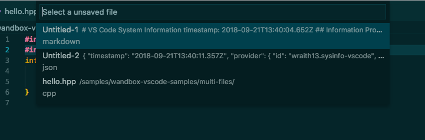
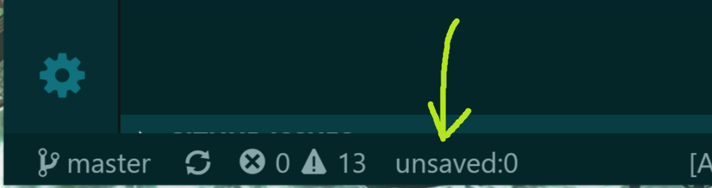

# Unsaved Files README

Easy access to unsaved files for vscode.

## Features

`Unsaved Files: Show` show unsaved files

## Tutorial

### 0. ⬇️ Install Unsaved Files

Show extension side bar within VS Code(Mac:<kbd>Command</kbd>+<kbd>Shift</kbd>+<kbd>X</kbd>, Windows and Linux: <kbd>Ctrl</kbd>+<kbd>Shift</kbd>+<kbd>X</kbd>), type `unsaved-files-vscode` and press <kbd>Enter</kbd> and click <kbd>Install</kbd>. Restart VS Code when installation is completed.

### 1. ✨️ Show Unsaved Files

Click `unsaved:*` in statub bar or launch Command Palette(Mac:<kbd>F1</kbd> or <kbd>Shift</kbd>+<kbd>Command</kbd>+<kbd>P</kbd>, Windows and Linux: <kbd>F1</kbd> or <kbd>Shift</kbd>+<kbd>Ctrl</kbd>+<kbd>P</kbd>), Execute `Unsaved Files: Show` command and select a unsaved file as you like.

### 2. 🔧 Next step

You can change [settings](#extension-settings) by `settings.json`.

Enjoy!

## Commands

* `Unsaved Files: Show` : show unsaved files

## Extension Settings

This extension contributes the following settings by [`settings.json`](https://code.visualstudio.com/docs/customization/userandworkspace#_creating-user-and-workspace-settings)( Mac: <kbd>Command</kbd>+<kbd>,</kbd>, Windows / Linux: <kbd>File</kbd> -> <kbd>Preferences</kbd> -> <kbd>User Settings</kbd> ):

* `unsaved-files.statusBar.enabled`: set Enable/Disable unsaved files count in status bar
* `unsaved-files.statusBar.label`: set unsaved's label

## Release Notes

see ChangLog on [marketplace](https://marketplace.visualstudio.com/items/wraith13.unsaved-files-vscode/changelog) or [github](https://github.com/wraith13/unsaved-files-vscode/blob/master/CHANGELOG.md)

## Support

[GitHub Issues](https://github.com/wraith13/unsaved-files-vscode/issues)

## License

[Boost Software License](https://github.com/wraith13/unsaved-files-vscode/blob/master/LICENSE_1_0.txt)
