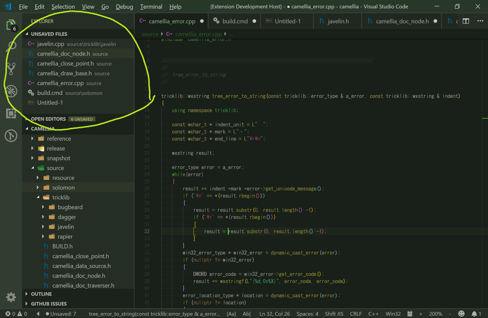

# Unsaved Files README

Easy access to unsaved files for vscode.

## Features

* show unsaved files from command pallete
* show unsaved files from status bar
* show unsaved files from view on explorer

> This extension only shows unsaved files, does not save nor close.

## Tutorial

### 0. ⬇️ Install Unsaved Files

Show extension side bar within VS Code(Mac:<kbd>Command</kbd>+<kbd>Shift</kbd>+<kbd>X</kbd>, Windows and Linux: <kbd>Ctrl</kbd>+<kbd>Shift</kbd>+<kbd>X</kbd>), type `unsaved-files-vscode` and press <kbd>Enter</kbd> and click <kbd>Install</kbd>. Restart VS Code when installation is completed.

### 1. ✨️ Show Unsaved Files

Click `unsaved:*` in status bar or launch Command Palette(Mac:<kbd>F1</kbd> or <kbd>Shift</kbd>+<kbd>Command</kbd>+<kbd>P</kbd>, Windows and Linux: <kbd>F1</kbd> or <kbd>Shift</kbd>+<kbd>Ctrl</kbd>+<kbd>P</kbd>), Execute `Unsaved Files: Show` command and select a unsaved file as you like.

### 2. 🔧 Next step

You can change [settings](#extension-settings) by `settings.json`.

Enjoy!

## Commands

* `Unsaved Files: Show` : show unsaved files
* `Unsaved Files: Show Next` show next unsaved file
* `Unsaved Files: Show Previous` show previous unsaved file
* `Unsaved Files: Show View` show view on explorer
* `Unsaved Files: Hide View` hide view on explorer

## Extension Settings

This extension contributes the following settings by [`settings.json`](https://code.visualstudio.com/docs/customization/userandworkspace#_creating-user-and-workspace-settings)( Mac: <kbd>Command</kbd>+<kbd>,</kbd>, Windows / Linux: <kbd>File</kbd> -> <kbd>Preferences</kbd> -> <kbd>User Settings</kbd> ):

* `unsaved-files.statusBar.enabled`: set Enable/Disable unsaved files count in status bar
* `unsaved-files.statusBar.noUnsavedFilesStatusLabel`: set no unsaved files's label
* `unsaved-files.statusBar.anyUnsavedFilesStatusLabel`: set any unsaved files's label
* `unsaved-files.statusBar.label`: set unsaved's label
* `unsaved-files.viewOnExplorer.enabled`: set Enable/Disable unsaved files in view on explorer

You can embed icons in the label text by leveraging the syntax:

`My text $(icon-name) contains icons like $(icon'name) this one.`

Where the icon-name is taken from the [octicon](https://octicons.github.com) icon set, e.g. `light-bulb`, `thumbsup`, `zap` etc.

You can specify unicode characters ( include emoji ) as label text too.

## Keyboard shortcut Settings

In default, Unsaved Files's commands doesn't apply keyboard shortcuts. Althogh,
you can apply keyboard shortcuts by [`keybindings.json`](https://code.visualstudio.com/docs/customization/keybindings#_customizing-shortcuts)
( Mac: <kbd>Code</kbd> -> <kbd>Preferences</kbd> -> <kbd>Keyboard Shortcuts</kbd>, Windows / Linux: <kbd>File</kbd> -> <kbd>Preferences</kbd> -> <kbd>Keyboard Shortcuts</kbd>).

Command name on `keybindings.json` is diffarent from on Command Pallete. See below table.

|on Command Pallete|on keybindings.json|
|-|-|
|`Unsaved Files: Show`|`unsaved-files.show`|
|`Unsaved Files: Show Next`|`unsaved-files.showNext`|
|`Unsaved Files: Show Previous`|`unsaved-files.showPrevious`|

## Release Notes

see ChangLog on [marketplace](https://marketplace.visualstudio.com/items/wraith13.unsaved-files-vscode/changelog) or [github](https://github.com/wraith13/unsaved-files-vscode/blob/master/CHANGELOG.md)

## Support

[GitHub Issues](https://github.com/wraith13/unsaved-files-vscode/issues)

## License

[Boost Software License](https://github.com/wraith13/unsaved-files-vscode/blob/master/LICENSE_1_0.txt)
